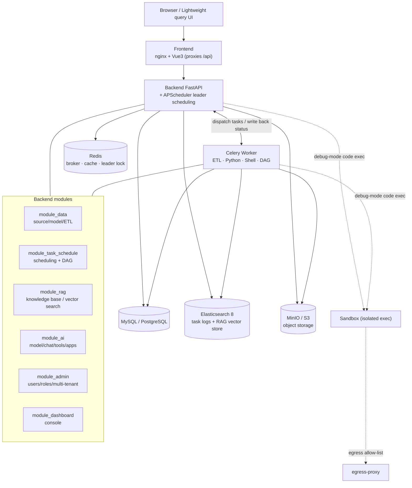

<h1 align="center">ezdata</h1>
<h4 align="center">AI-native data platform — data ingestion · ETL integration · task orchestration · knowledge base (RAG) · AI analysis</h4>

<p align="center">
  
  
  
  
  
</p>

<p align="center">
  <b>English</b> | <a href="README.zh-CN.md">简体中文</a>
</p>

<p align="center">
  🌐 Live demo: <a href="http://124.220.57.72/"><b>http://124.220.57.72/</b></a>
</p>

> ezdata is an AI-native data platform: unify heterogeneous data sources, run ETL integration and task orchestration, build per-source knowledge bases (RAG), and feed that knowledge to AI for data retrieval and analysis. Ships with RBAC + multi-tenancy + data permissions (built on the [RuoYi-Vue3-FastAPI](https://github.com/insistence/RuoYi-Vue3-FastAPI) scaffold).

## ✨ Core capabilities

- **Data management** `module_data`: 60+ connectors (RDBMS / Elasticsearch / MongoDB / Kafka / vector stores / object storage …), data source → data model → query / data API, ETL integration built on [dlt](https://dlthub.com/); read-only guardrails + AI-driven querying. **Metric layer** — define a metric once (measures + dimensions + semantics + reviewed sample, built on top of `data_model` and executed by reusing the handler), and AI fetches authoritative, consistent numbers by metric name (the definer has the final say). **Task-level lineage** — from a task's extract/load parameters and its bindings to models/metrics/dashboards/skills, a declarative (no SQL parsing, always fresh) "source → task → model → metric/dashboard/skill" lineage graph powers impact analysis and staleness protection (edit a model → downstream dependencies are flagged "needs review").
- **Scheduling & workflows** `module_task_schedule`: Celery + APScheduler for scheduled jobs; **task workflows (DAG)** orchestrated on an AntV X6 canvas — event-driven, versioned, single-node/distributed run modes, plus run monitoring.
- **Knowledge base (RAG)** `module_rag`: document (pdf/docx/excel/pptx/csv/md/web…) extraction → chunking (incl. semantic / Markdown) → embedding → **ES8 vector store (dense_vector + kNN + BM25 hybrid retrieval)**; Contextual Retrieval, incremental training, QA, and **a dedicated knowledge base per data source**; the processing layer integrates [Agno](https://github.com/agno-agi/agno) (readers / chunking / VectorDb wrappers).
- **AI** `module_ai` / `module_dashboard`: unified AI model management (keys AES-encrypted, **reasoning/thinking** models supported); Agno Agent chat — discover data sources, inspect table schemas, retrieve from knowledge bases, run queries/computation in a sandbox and produce conclusions + **charts/tables**; **Agent Skills** (Claude-Skills-style: a capability pack = description + SKILL.md body + attached files + soft references, **progressive disclosure** via on-demand `load_skill`; procedural/knowledge types; full-screen IDE editor + import folder/zip + export); **AI tools** (built-in tools + MCP integration), **AI apps** (package a prompt/tools/knowledge base/skills into a standalone assistant + outward-facing API key), and **cross-session long-term memory**; within a conversation you can also **propose / edit / duplicate / debug-run tasks** (AI fills the form, a human decides). **Catalog vector-retrieval narrowing** — for large databases, retrieve and inject only the Top-K relevant tables per question instead of the full catalog (saves tokens, stays focused), together with context/tool slimming and prompt caching; the retrieval funnel is **metric-layer-first** (`query_metric` returns authoritative numbers, no hand-written SQL/aggregation) → on miss, use **lineage** to locate governed models → source-recognized retrieval → free-form querying against raw tables; console overview (ECharts).
- **System**: users / roles / menus / departments / dictionaries, RBAC + **multi-tenancy** + data permissions.
- **Lightweight query UI** `ezdata/interface/web` (optional): a minimal standalone tool that runs without the platform — stdlib `http.server` + `sqlite3` connection catalog + agno LLM (openai/anthropic); connect a data source → browse tables/fields → native or AI querying → export to Excel. `python -m ezdata.interface.web`; see that directory's `README.md`.

## 🧱 Tech stack

| Layer | Tech |
|---|---|
| Frontend | Vue 3 · Element Plus · ECharts · AntV X6 · Vite |
| Backend | FastAPI · SQLAlchemy 2.0 (async) · Pydantic v2 |
| Tasks | Celery · APScheduler · dlt |
| AI / RAG | Agno · DashScope/OpenAI embedding · chonkie · unstructured |
| Storage | MySQL 8 / PostgreSQL · Redis · **Elasticsearch 8** · MinIO/S3 |

## 🏛 Architecture

Container-per-service: the frontend (nginx + Vue3) reverse-proxies `/api` to the backend; the backend (FastAPI) runs APScheduler in-process (a startup lock elects a leader, so only one instance schedules across replicas); Celery workers independently execute ETL / Python / Shell / DAG tasks; debug-mode code runs in an isolated sandbox with egress allow-listed. Everything is driven by a single `.env` in the same directory.



> Deployment topology, network isolation, and per-service responsibilities: see [docs/DEPLOY.md](docs/DEPLOY.en.md).

## 🚀 Quick start (Docker)

```bash
# 1) Prepare env vars (required: .env.dev is git-ignored; if missing, the backend
#    falls back to default DB names and can't connect)
cp api/.env.dev.example api/.env.dev

# 2) Bring up the dev stack (MySQL + Redis + ES8 + MinIO + backend + worker + frontend)
docker compose -f docker-compose.dev.yml up -d

# Production reference: docker-compose.yml (MySQL by default; for PostgreSQL add --env-file .env.pg)
```

- Frontend defaults to `http://localhost:12580`, backend to `http://localhost:9099` (Swagger: `/docs`).
- **Default login**: `admin` / `admin123`.
- **Out-of-the-box finance demo** (auto-imported on first start; re-runnable via `api/demo_seed.py`): an AKShare finance data source + built-in ES (`demo_es`) + **28 data-integration tasks / 27 data models** (A-share/HK/US/ETF snapshots; A-share daily bars (scheduled incremental on page-1 snapshots + a one-shot full backfill, sharing `fin_stock_daily`); index daily bars; limit-up pool; dragon-tiger list; capital flows; margin trading; concept/industry sectors; technical screening; earnings/IPOs/convertible bonds; macro CPI/PPI/GDP/LPR, etc., scheduled in **Beijing time**) + an **A-share market overview multi-chart dashboard** + a "Finance Data Analysis Assistant" AI app (conversational querying + charting). Schedule expressions are 7-field Quartz (sec min hour day month week year), matching the frontend cron component.
- **Default middleware credentials** (unified across dev / prod compose, for local / intranet only): `ezdata123456` — MySQL `root`, PostgreSQL `postgres`, Redis, MinIO `minio`, Elasticsearch `elastic`. ⚠️ For any public deployment, change to strong passwords or inject via env vars / secrets.
- Init SQL: `api/sql/ezdata.sql` (MySQL) / `api/sql/ezdata-pg.sql` (PostgreSQL), auto-mounted and imported on first start.

For local (non-container) development, see [docs/DEPLOY.md](docs/DEPLOY.en.md).

## 📁 Layout

```
api/                 Backend (FastAPI)
  module_admin/      System: users/roles/menus/multi-tenancy
  module_data/       Data sources / models / querying / ETL (dlt) / metric layer / lineage
  module_task_schedule/  Task scheduling + DAG workflow orchestration
  module_rag/        Knowledge base (RAG): extraction/chunking/vector store (ES8)/retrieval/per-source KB
  module_ai/         AI models / chat / tools / apps / skills (Agent Skills) / catalog retrieval
  module_dashboard/  Console overview
web/                 Frontend (Vue3 + Element Plus)
docs/                Design & deployment docs (module-level design also lives under api/module_ai·module_data/docs/)
```

## 📚 Docs

- [Deployment guide](docs/DEPLOY.en.md)
- [Data module design](docs/DATA_MODULE_DESIGN.en.md)
- [Metric layer + task-level lineage design](docs/metric-layer-and-lineage-design.en.md)
- [DAG workflow design](docs/DAG_WORKFLOW.en.md)
- [Knowledge base (RAG) design](docs/RAG_MODULE.en.md)
- [Agent Skills & context/tool slimming](docs/skill-agent-optimization.en.md)
- [Catalog retrieval narrowing design](docs/catalog-retrieval-narrowing-design.en.md)
- [Changelog](docs/CHANGELOG.en.md)
